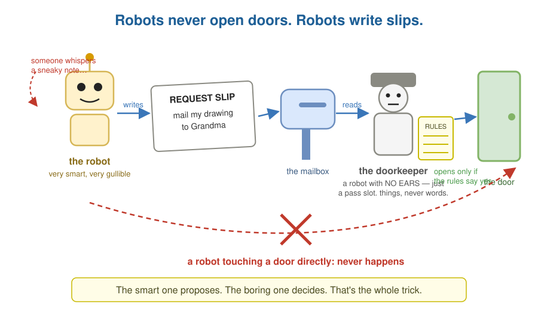
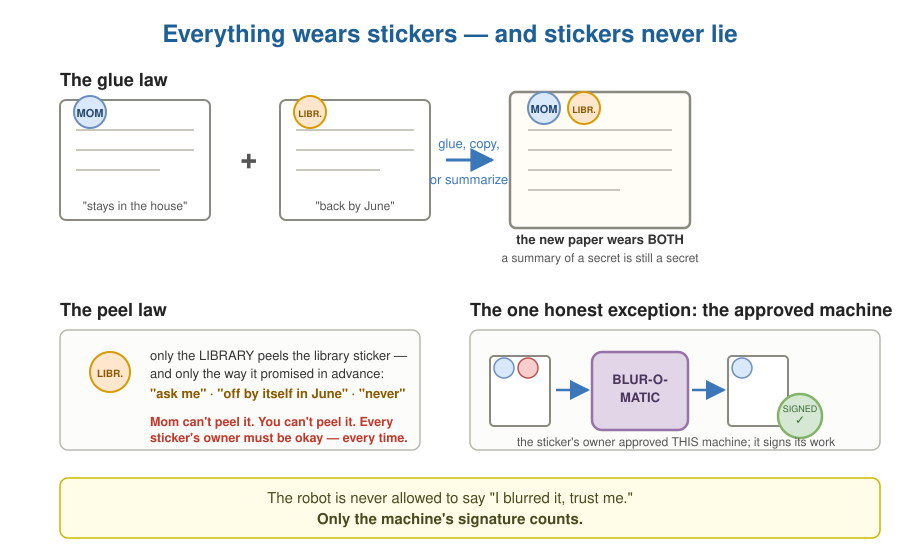
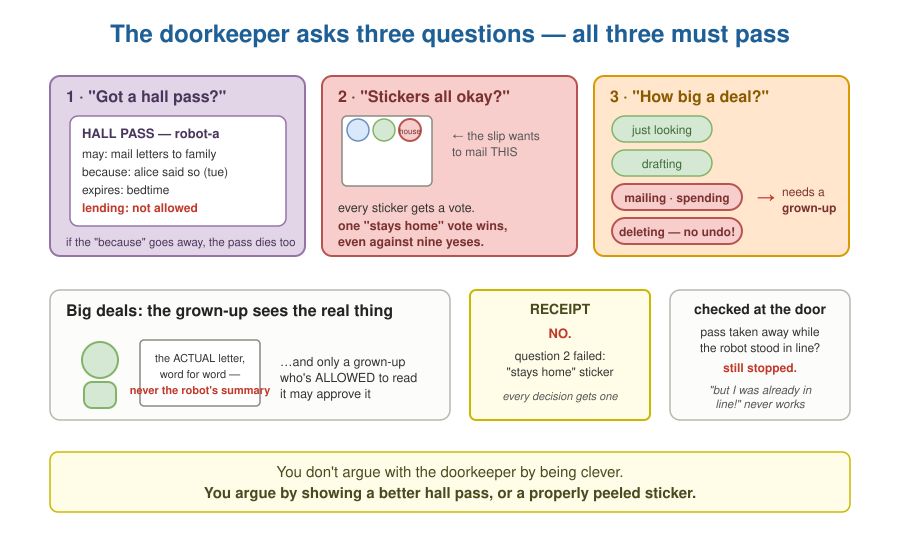
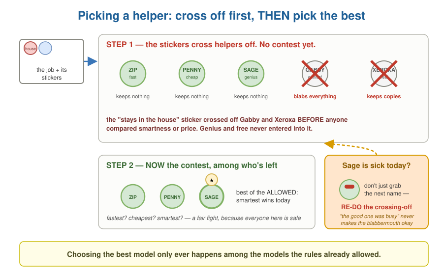

<!--
  Title: Miniforge.ai
  Author: Christopher Lester (christopher.ai)
  Copyright 2025-2026 Christopher Lester. Licensed under Apache 2.0.
-->
# The Robot Helpers and the Sticker Rules

*The agent policy and routing architecture
(`../tenancy-ownership-access.md` §11, §13), explained the way
Feynman would insist on: if you can't say it simply, you don't
understand it yet. Companion to
[Your House, Their Clubhouse, and the Passes](tenancy-for-a-nine-year-old.md),
which covers whose things are whose. Grown-up translation table at
the end.*

---

## The robots never open doors

Your house has robot helpers. They are very smart — and very
gullible. Anyone who slips a note into a robot's ear can talk it
into wanting almost anything. That's not the robot being bad; it's
just how robots are.

So we made one house rule that fixes everything else:

> **Robots never open doors. Robots write request slips.**

When a robot wants to do something — send a letter, spend a dollar,
show your drawing to a neighbor — it writes exactly what it wants
on a slip and puts the slip in a mailbox. A very careful, very
boring doorkeeper reads every slip. The doorkeeper is a robot too —
but a robot with **no ears**. There is nowhere to whisper into. You
can hand it a slip, a pass, a sticker: things, never words. It
cannot be talked into anything, because it cannot be talked to at
all. It only follows rules.

The smart one proposes. The boring one decides. That's the whole
trick, and everything else is details.

## Everything has stickers

Every piece of information in the house wears **stickers**. A
sticker says three things:

1. **Who put it there.** Mom, the library, grandma's cookbook
   company. The sticker remembers its owner forever.
2. **Where this may go.** Stays in your room; stays in the house;
   may go to school; may go anywhere.
3. **What it may be used for.** Homework yes, showing off no.

Two sticker laws:

**Glue law.** If you glue two papers together — or copy a bit of
one onto the other, or write a summary of them — the new paper gets
**all the stickers from both**. You cannot lose a sticker by
rewriting the words. A summary of a secret is still a secret.

**Peel law.** Nobody can peel a sticker except the one who put it
on — and even they must peel it the way they promised in advance:
maybe "ask me and I'll say yes or no," maybe "it comes off by
itself next summer," maybe "never." The library's sticker doesn't
come off because Mom says so, and Mom's doesn't come off because
the library says so. Every sticker's owner has to be okay with it,
every time.

There is one honest exception: some sticker-owners approve a
special **machine** — like a photocopier that blurs out faces. If a
paper goes through *that exact machine*, certain stickers come off,
and the machine signs its name saying it did the job properly. The
robot is never allowed to say "I blurred it, trust me." Only the
machine's signature counts.

And one more thing about stickers — the sneakiest trap in the whole
house, closed by the simplest rule: what if a whispered note talks a
robot into *drawing* a sticker? A fake "may go anywhere," inked right on
the paper? Nothing happens, because **robots never touch stickers at
all.** Every paper travels in a clear **envelope**, and stickers
live on the envelope — and only doorkeepers seal, open, or stamp
envelopes. When a robot makes a new paper, the doorkeeper envelopes
it and stamps on the stickers from everything the robot had been
reading — the glue law is the doorkeeper's job, not the robot's. So
a sticker a robot draws is just a *picture* of a sticker, on the
paper, inside the envelope. The doorkeeper reads envelopes. It has
never once read a picture.

## The doorkeeper asks three questions

For every slip, the doorkeeper checks three separate things — and
all three have to pass:

1. **"Do you have a hall pass for this door?"** You gave each robot
   its own pass. A pass names what the robot may do, expires on its
   own, and remembers *why* it exists — so if the reason goes away,
   the pass dies with it. A robot can lend a smaller pass to a
   helper robot, but only if its own pass says "lending allowed,"
   and the lent pass can never be bigger than the original.
2. **"Do all the stickers allow where this is going?"** Every
   sticker on everything mentioned in the slip gets a vote. One
   "stays in the house" sticker means it stays in the house — even
   if nine other stickers say fine.
3. **"How big a deal is this?"** Looking at something is small.
   Writing a draft is small. Mailing a letter, spending money,
   deleting things — those can't be undone, so they're big. Big
   deals need a grown-up to say yes first. And the grown-up gets
   shown *exactly* what will go out the door — never the robot's
   own summary of it.

The doorkeeper then writes a **receipt**: yes or no, and the
reasons. If the answer was no, the receipt says which question
failed. Nobody argues with the doorkeeper by being clever; you
argue by showing a better hall pass or a peeled sticker.

One more doorkeeper habit, and it matters: passes are checked **at
the moment the door opens**, not when the robot got in line. If you
took a robot's pass away while it was standing in line, it still
gets stopped at the door. "But I was already in line!" doesn't work
on the boring doorkeeper.

## Picking which helper does the job

Some jobs get sent out to helpers outside the house — some helpers
are fast, some are cheap, some are brilliant, and some *blab
everything they hear* or keep copies of what you show them.

Here is the rule that makes routing safe, and it works like
order of operations in math:

> **First cross off everyone the stickers forbid.
> Only then pick the best of who's left.**

A paper with a "stays in the house" sticker can never go to the
neighbor kid — even if he's the smartest helper on the street, even
if he's free, even if he's standing right there. He was crossed off
before the contest started. The contest — fastest? cheapest?
smartest? — only ever happens between helpers the stickers already
allow.

And if your chosen helper is sick today, you don't just grab the
next name on the list. You **re-do the crossing-off** for the new
helper. "The good one was busy" has never once made it okay to
hand a secret to a blabbermouth.

One more thing the crossing-off knows: **it remembers.** A helper
who broke a promise last month — kept a copy they swore not to
keep, took twice as long as the slip allowed — gets crossed off for
a while too, before the contest, like everyone else the rules
forbid. Being fast and brilliant buys nothing back until the
penalty box empties.

## The blackboard

The robots share a big blackboard where they leave notes for each
other. Stickers ride on **each note** — not on the blackboard.

So if robot A pins up a note made from secret stuff, and robot B
never reads that note, robot B's work stays unstickered. B can
still use the fast outside helper for its own public job. Only the
robots that actually *read* the secret note carry its stickers
forward. The blackboard is furniture, not glue.

---

## The same story in grown-up words

| In the story | In the architecture |
|---|---|
| the gullible robot | the model / agent — persuadable by any injected text |
| the request slip | `ProposedTransaction` — the model proposes, never executes |
| the boring doorkeeper | the deterministic runtime — `decide(…)` |
| the doorkeeper's missing ears | the runtime accepts only typed inputs (proposals, grants, clauses) — no natural-language surface for injection to grab |
| stickers live on the envelope, never the paper | the label plane is runtime-maintained metadata — model output is payload only; output clauses are computed from actual inputs, never declared |
| a drawn sticker is just a picture | in-band "labels" are content; forgery is unrepresentable, and transform receipts are runtime-attested |
| a sticker | `PolicyClause` — authority + destination constraints + purpose + operations |
| who put the sticker on | the clause's authority (a tenant, a licensor, a contract) |
| the glue law | clause union on derivation — labels survive rewriting |
| the peel law | relaxation modes — every affected authority must authorize, its declared way |
| the blur machine + signature | `PolicyTransform` — an authority-approved transform run by a trusted capability version, with attestation |
| the hall pass | `ExecutionGrant` / `Delegation` — scoped, expiring, lineage-bearing |
| "lending allowed" | `:delegable?` — a separate authority from holding |
| the three questions | the three planes: authority, information flow, effect |
| big deals need a grown-up | effect classes; irreversible/high-impact effects require human approval |
| shown exactly what goes out | approval binds to the rendered payload's hash — and the approver must be allowed to see it |
| the receipt | `DecisionEnvelope` — allowed?, reason codes, obligations, revision pins |
| checked when the door opens | commit-time recheck under the freshness contract |
| cross off, then contest | policy-first routing: eligibility filter before quality/latency/cost ranking |
| re-do the crossing-off | fallback re-runs eligibility, never just ranking |
| the crossing-off remembers | breach history is an eligibility input — revocations for cause drop a binding from the candidate set before ranking |
| stickers on notes, not the blackboard | scoped taint: artifact-level labels; the blackboard is a container, not a flow |

The one-sentence version, suitable for saying out loud:

> **Models propose. Deterministic authority, information-flow, and
> effect-control systems decide and execute — and choosing the best
> model only ever happens among the models the rules already
> allowed.**
