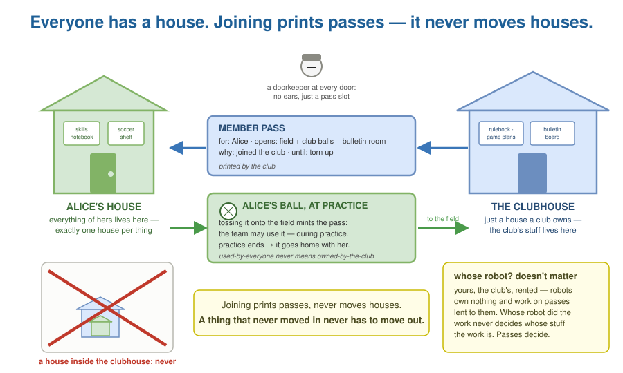
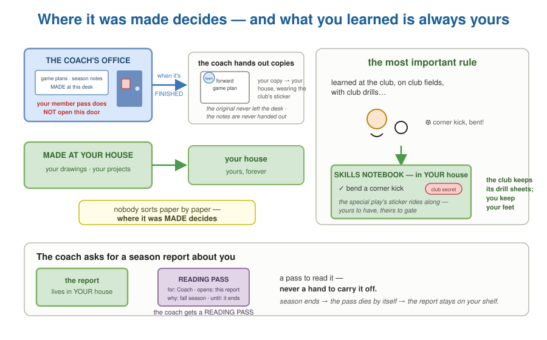
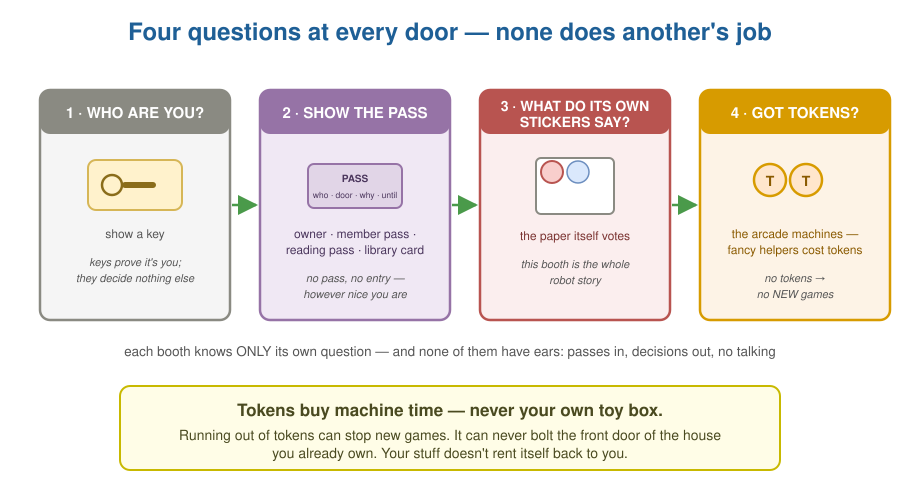
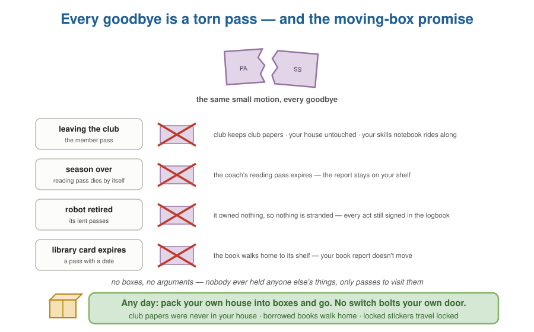

<!--
  Title: Miniforge.ai
  Author: Christopher Lester (christopher@miniforge.ai)
  Copyright 2025-2026 Christopher Lester. Licensed under Apache 2.0.
-->
# Your House, Their Clubhouse, and the Passes

*The tenancy, ownership, and rights architecture
(`../tenancy-ownership-access.md` §1–§10, §12), explained simply —
in the same world as
[The Robot Helpers and the Sticker Rules](routing-for-a-nine-year-old.md).
Same house, same doorkeeper, same stickers; this story is about
whose things are whose. Together the two stories are the simplicity
invariant: if a future change to the architecture cannot be told in
the story, the change is suspect. Grown-up translation table at the
end.*

---

## Everyone has a house

You remember the house with the robot helpers and the boring
doorkeeper. Now zoom out: **everyone has a house of their own.**
Everything you have lives in your house — your drawings, your
report cards, your skills notebook. That is what "yours" *means*
here: **every single thing lives in exactly one house.** First
rule; it never bends.

Clubs have buildings too. The soccer club's clubhouse holds the
club's own things — the rulebook, the bulletin board, the game
plans. A clubhouse isn't fancier than a house; it's just a house
that a club owns.

And every door everywhere — your house, the clubhouse, the coach's
office, the library desk, the gate to the practice field — has a
**doorkeeper** standing at it. Here's the doorkeepers' secret, and
it's the whole trick of this world: they're robots too, but a
special kind — **no ears, just a pass slot.** You can hand a
doorkeeper a pass. You cannot talk to one. Nobody has ever talked a
doorkeeper into anything, because nobody has ever talked *to* a
doorkeeper at all.

## Joining a club prints passes. It never moves houses

Nobody walks through anyone else's door without a **pass**. You've
seen passes already — the robots carry them. A pass always says
four things: *who* it's for, *which door or shelf* it opens, *why
it exists*, and *when it expires*. If the why goes away, the pass
dies with it.

So what is "joining the soccer club"? The club prints **you** a
member pass — it opens the practice field, the bulletin board room,
and the bin of club balls. Sometimes the club pays for everything:
club balls, club uniforms. You use them there, through your pass.
They never come home as yours.

And then you *play*. Here's the part that matters: **the season is
a thing you do together, on the field.** The coach sees your corner
kicks because the coach was standing right there coaching them —
not because anyone opened a door into your house. Playing together
is its own shared place, and everyone in it sees what happens in
it. Nobody needs a pass into anybody's house to play on a team.

Now bring **your own ball** to practice. The moment you toss it
onto the field, you've minted a little pass without saying a word:
*the team may use my ball — during practice.* Practice ends, the
ball goes home with you. It was never the club's, not even a
little, no matter how many teammates kicked it. **Used-by-everyone
never means owned-by-the-club.** And if you'd rather not bring it
tomorrow, you just… don't. That's the whole revocation.

Notice what never happened in any of this: your house did not get
picked up and craned into the clubhouse. Nothing of yours moved
anywhere, and nobody got a pass into your house at all. Joining a
club is **printing passes, never moving houses** — and that's why
leaving will be easy later. A thing that never moved in never has
to move out.

One small thing about you and your keys: you might have a front
door key, a spare at grandma's, a new one after you lost the old
one. Keys prove it's *you* at the door. Losing a key, or adding
one, never changes whose house it is.

And the robots? Robots work everywhere in this world — your robots,
the club's robots, even a robot you rent for an afternoon. Here's
the thing that surprises grown-ups: **it never matters who owns the
robot.** Robots own nothing and hold nothing of their own — a robot
working for you works on passes lent from yours (smaller ones, and
only if yours say "lending allowed" — you know this from the robot
story). Whose robot did the work never decides whose stuff the
work is. The passes and the slips decide.

## Whose paper is it?

Whose is a paper? **It belongs to the place where it was made** —
copies may travel later, but belonging doesn't:

- The game plans and the coach's notes get written at the coach's
  desk, in the coach's office. Club papers, belonging to the club.
  And notice a detail: **your member pass doesn't open the coach's
  office.** Being in the club never meant every club door — the
  office door has a doorkeeper like every other, and it won't take
  your member pass. "But I'm on the team!" lands on nothing,
  because doorkeepers have no ears.
- Your drawings and projects get made at your house. Yours.

Nobody stands sorting paper by paper. **Where it was made
decides.** That's the whole rule, so there's never an argument
about any single paper.

When the forward game plan is *finished*, the coach walks out and
hands the forwards their copies. That's the club **choosing** to
share a club paper: the copy was made *for you*, so your copy comes
home to your house — wearing the club's sticker — "team eyes only" —
which rides wherever the copy goes (glue law). The original never
left the coach's desk. And the coach's notes? Those may never be
handed out at all — some club papers no member ever sees. (Years
from now the coach might give their old notebook to their kid who's
becoming a coach. That's the owner giving the *thing itself* away —
always the owner's to do, and nobody else's.)

But here is the most important rule in the whole story:

> **What you learned is always yours.**

You got better at soccer *at the club*, with *club drills*, on
*club fields*. Doesn't matter. "I can bend a corner kick" goes in
the skills notebook in **your** house, forever. The club keeps its
drill sheets; you keep your feet. When you're twenty and trying out
somewhere new, that notebook is what you bring — that's what a
skills notebook is *for*.

One catch, and it's fair: if what you learned includes a club
secret — the special play nobody else knows — the secret's sticker
rides along in your notebook (glue law, from the robot story). The
skill is yours to keep; the secret detail is still the club's to
unlock. Yours to have, theirs to gate.

And when the coach asks for a season report about you? The report
is about you, for your growing up — so it lives in **your** house.
The coach gets a **reading pass** to that one report, through the
season. A pass to read it — never a hand to carry it off. Season
ends, pass dies, report stays.

## The doorkeeper's four questions

At every door, every time, the doorkeeper asks four questions. Each
question is its own question — on purpose, so no answer can be
stretched to cover another:

1. **"Who are you?"** Show a key. Keys prove it's you; they decide
   nothing else.
2. **"Show the pass for THIS door."** Owner of the house? That's
   the deepest pass there is. Member pass, reading pass, library
   card — each opens exactly what it names. No pass, no entry,
   however nice you are.
3. **"What do the thing's own stickers say?"** Even inside a door
   your pass opens, each paper votes for itself — where it may go,
   what it may be used for. (This question is the whole robot
   story.)
4. **"Tokens, for the big machines?"** The fancy helpers cost
   tokens to run. No tokens, no new machine time.

And the token rule has a hard edge worth saying twice: **tokens buy
machine time, never your own house.** Running out of tokens can
stop new jobs. It can never, ever bolt your own front door against
you. Your stuff doesn't rent itself back to you.

## Borrowed things

The library book on your shelf is *in* your house — but it isn't
*yours*. Holding a thing was never the same as owning it.

Your **library card is a pass with a date on it**: you to the
library, until June. Through it you may read the book, learn from
it, write a book report. When the card expires, the book goes home
to its shelf — every page. You never got to photocopy it, so
there's nothing to sneak.

But your **book report is yours.** That's what lending a book
*means*: read, learn, make something of your own. The report stays
in your house; the book goes back. (If the library had a special
rule — "no quoting page 12" — that sticker rides on your report.
Glue law, as always.)

And the comic you found on the street? It's *somebody's*. You don't
know whose, and "I found it" doesn't make it yours. Read it today,
fine; copy it into your own zine, no — not unless a grown-up checks
and writes down that it's really free to use. Not knowing the owner
makes you *more* careful, not less.

## Mary's hall pass

A pass is a deal in both directions — and the rules ride on the
pass. Mary got a hall pass at school: *bathroom, and back.* But the
school store was right there, and candy bars are candy bars. So
instead of going back to class she went to the store, bought one,
and ate the whole thing before strolling back — half a class
later.

Here's the thing: **no doorkeeper could have stopped her.** Her
pass was real. The hallway was allowed. Every door she passed did
exactly its job. She got caught anyway — at turn-in. The logbook
had the store door's stamp and the times, and stamps and times
don't lie. Gates stop what they can. **Logbooks catch the rest.**

And then two things happened, and only the first one is the usual
one. The pass was done — fine, it was done anyway. But also: **no
hall passes for Mary for the rest of the semester.** Breaking a
pass's rules doesn't just end that pass. It changes whether you get
the *next* one.

The library plays the same game with bigger stakes. Keep the book
past your card's date and the library does exactly the thing you
agreed to when they handed you the card: a fine, and no new
borrowing until it's paid. Nobody's surprised — the deal was on the
card the whole time. Sometimes the consequence of breaking a deal
is more than a torn-up pass, and you signed up for it on the day
you took the pass.

## Sneaky Bob

Sneaky Bob has boxes he'd rather not keep at his own house — if
anyone ever comes asking, he wants them found at *yours*. So he
gets clever.

First he tries fake envelopes: official-looking stamps that say
"this belongs at Alice's house." The doorkeeper doesn't even look
up. An envelope means something only when a doorkeeper's *own*
stamp is on it, and stamps happen at doors, when a pass is shown.
Bob has no pass to your house. There is no envelope he can bring
that substitutes for one.

So he tries the porch. Every house has one open spot on purpose —
the delivery porch, where people can leave things for you. At three
in the morning, Bob dumps his boxes there. But here's the porch
rule: **nothing becomes yours just because it showed up.** Things
on the porch are marked *delivered — not accepted*, and the
doorkeeper's logbook records exactly when each one arrived and who
left it (or that no pass was shown at all). You take a thing
inside, or you don't. Sweep it off the porch, and it was never
yours for a single minute.

And the frame-up itself? It dies at the **logbook**. Every single
thing inside your house has a line in the doorkeeper's own
handwriting: who brought it, through which door, with which pass.
Bob can't write in the logbook. Nobody can — it's the doorkeeper's
hand or nothing. So when the police come asking, they don't read
piles; they read logbooks. The logbook is the end of Sneaky Bob.

Notice this is the library rule's mirror: holding a thing was never
the same as owning it — and being *handed* a thing was never the
same as answering for it.

## Goodbyes, and the moving-box promise

Watch how many different goodbyes turn out to be the same small
thing — **a pass gets torn up:**

- Leaving the club? Your member pass — torn. The club balls stay
  in their bin.
- Season over? The field goes quiet; the coach's reading pass dies
  on its own; the report stays on your shelf. Your ball is already
  home — it always was.
- Robot retired? Its lent passes — torn. It owned nothing, so
  nothing is stranded.
- Library card expired? The book walks home to its shelf; your
  report doesn't move.

No boxes, no arguments, nothing carried anywhere. Nobody ever
*held* anyone else's things — only passes to visit them. Tear the
pass and the visit is over; every house still holds exactly what it
always held.

And the last rule, the one this whole story protects:

> **Any day you like, you can pack your own house into moving boxes
> and go. There is no switch, anywhere, that bolts your own door
> against you.**

Not a club rule, not fine print, nothing — on purpose. If such a
switch existed, every club would demand it be flipped, and then it
wouldn't be your house anymore. And packing is simple, because the
first rule did all the work: club papers were never in your house.
Borrowed books walk home. Stickers with locks travel still locked.
There is nothing in your boxes that belongs to anyone else — which
is exactly why no one gets a say about your boxes.

---

## The same story in grown-up words

| In the story | In the architecture |
|---|---|
| your house | a personal tenant — a person IS a tenant; every record has exactly one owner (A1, A2) |
| the clubhouse | an organizational tenant — structurally the same, owned by a club |
| a pass (who · which door · why · until) | a relation/grant — scoped, expiring, lineage-bearing; membership is a relation, never containment (A3) |
| the season, played together on the field | an engagement object — a shared process; org roles see engagement things, never the inside of your house |
| bringing your ball to practice | an owner-granted, activity-scoped grant — implicit, auto-expiring; use never transfers ownership |
| the club pays for everything | org-owned assets, used through membership; they never become yours |
| "the why goes away, the pass dies" | grant lineage — authorization requires a still-valid basis |
| keys | credentials authenticating a principal; `#controller` relations bind them to the tenant |
| whose robot never matters | agents are tenant-less principals; outputs follow ownership rules, not robot ownership |
| papers live where they're made | creation-context provenance — the creating context stamps the owner |
| the coach's office your pass doesn't open | org-interior workspaces and records — membership never means all-access |
| being handed the finished game plan | an org sharing its asset: your copy carries the club's clause ("team eyes only") |
| the coach's notes, never handed out | org-internal records members never see |
| nobody sorts paper by paper | no per-record adjudication on the normal path |
| "what you learned is always yours" | the IP boundary: claims and profile are personal-owned, always — the resume norm |
| the secret's sticker rides along | inherited disclosure clauses gate details without changing ownership |
| the coach's reading pass | `#commissioner` / `#viewer` relations — commissioning grants visibility, not ownership |
| the four questions | the four layers: authentication, authorization, disclosure & processing, entitlement |
| a doorkeeper at every door | every boundary crossing is a policy decision point |
| Sneaky Bob's fake envelopes | forged ownership/provenance fails runtime attestation — labels are stamped only at authorized doors |
| the delivery porch | push-capable intake is quarantine: custody-pending until the owner (or the owner's standing rule) accepts — delivery is not acceptance |
| the doorkeeper's logbook | every record carries its runtime-written creating context (principal, channel, revision) — the audit trail attributes the act, not mere possession |
| Mary's candy-bar detour | grants are purpose-bound; adherence that can't be gated in the moment is audited via receipts and the provenance log |
| no hall passes this semester | breach degrades the grantor's future granting policy for that grantee — not just the instance |
| the fine that was on the card all along | pre-agreed remedies ride the grant's terms; for non-resident authorities the system supplies attested evidence, not enforcement |
| gates stop what they can; logbooks catch the rest | prevention at decision points + detection at reconciliation — both required |
| doorkeepers have no ears | the policy runtime accepts only typed inputs (passes, slips, stickers) — no natural-language surface, so injection has nothing to grab |
| tokens never bolt your door | entitlement gates compute, never data |
| the library card with a date | a license as a relation object, time-boxed — access routes through it |
| the book goes home; the report stays | expiry quarantines/purges licensed payloads; term-driven derivation keeps your analytics |
| "no quoting page 12" rides the report | license clauses ride derived work — `PolicyTransform` is the only legitimate way off |
| the street comic | third-party-unknown intake — public is not public domain; upgrades are recorded human determinations |
| every goodbye is a torn pass | one revocation mechanism: cut the relation; runtime enforcement completes it |
| the moving-box promise | the takeaway export — always available, hard policy, no configuration surface |
| what's not in the boxes | ownership filter, then rights filter, then exportability — clean by construction |

And the two stories snap together without a seam: houses and passes
say *whose things are whose and who may visit*; slips and stickers
say *how anything gets done without trusting the persuadable part*.
The doorkeeper is the same doorkeeper. That's the entire
architecture.
