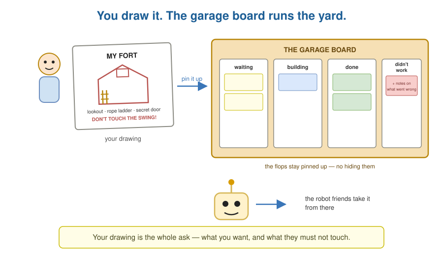
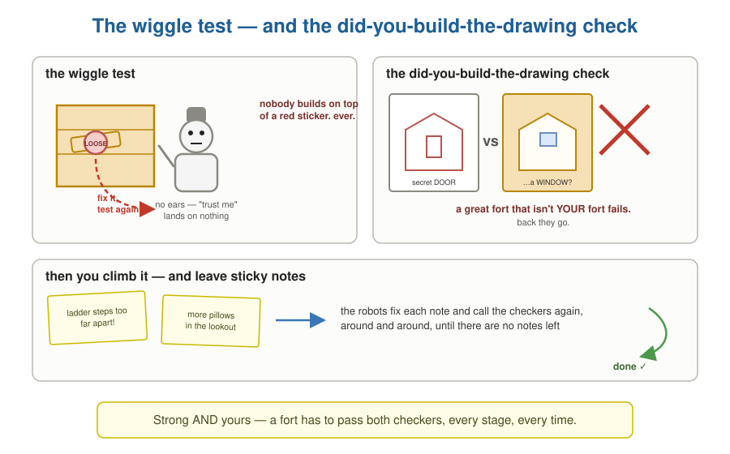
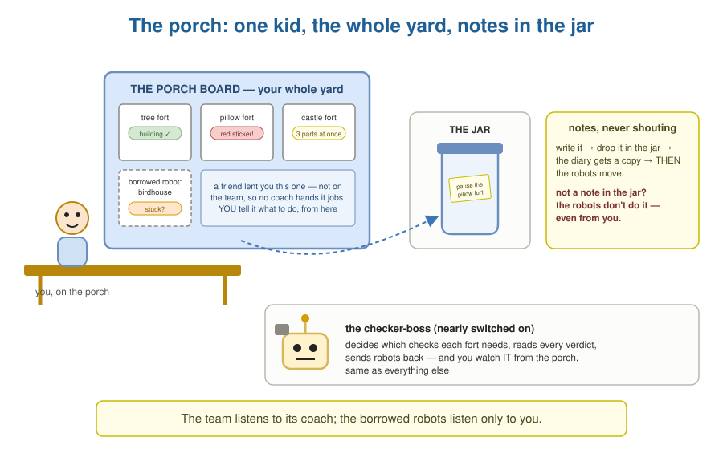
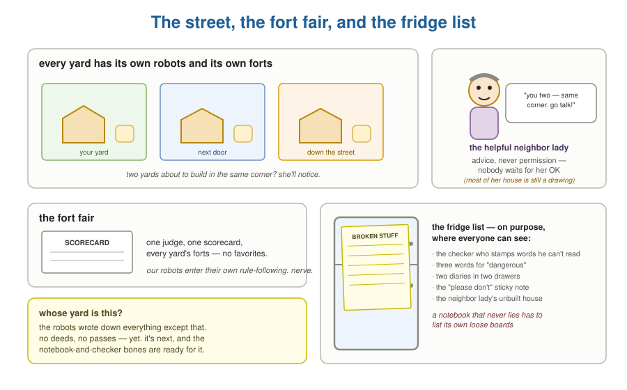

# The Fort-Building Robots

*Miniforge, explained simply — same world as the house, the
clubhouse, and the sticker rules. Same gullible robots, same
no-ears checkers, same two notebooks. Grown-up translation table
at the end.*

---

## Draw what you want

You want a fort. So you draw it: *a lookout on top, a rope
ladder, a secret door. Don't touch the swing.* You pin your
drawing to the board on the garage door, and the robot friends
take it from there.

The garage board has four columns: **waiting**, **building**,
**done**, and **didn't work** — and the didn't-work drawings stay
pinned up with notes on them, so anybody can see what went wrong.
No hiding the flops.

## How the robots build

Every fort goes the same way:

1. **Look at the yard.** Where's the good tree? Where's the swing
   we can't touch?
2. **Make the job list.** The team has a **coach**. The coach
   turns your drawing into jobs — *ladder first, then floor, then
   walls, then lookout* — and hands each robot its job. You never
   boss a team robot around one at a time; that's the coach's
   whole job. And if your drawing already lists the jobs? The
   coach doesn't redo your thinking — just checks the list makes
   sense and gets going.
3. **Build.**
4. **Wiggle test.** A checker grabs every board and *wiggles* it.
   Loose board? Red sticker. Red sticker means **fix it and test
   it again** — and nobody builds on top of a red sticker, ever.
   The checker has no ears, so "it's fine, trust me" lands on
   nothing.
5. **The did-you-build-the-drawing check.** A different checker
   holds up your drawing next to the fort. Lookout? Yes. Rope
   ladder? Yes. Secret door? …they built a *window*. **A great
   fort that isn't your fort fails.** Back they go.
6. **Show you.** You climb it, hang on stuff, and leave sticky
   notes: *ladder's too far apart. More pillows.* The robots work
   the sticky notes until there aren't any.
7. **Write down what they learned.** *Wet rope slips. Floor
   before walls.* Into the team notebook — next fort starts
   smarter.

## Big forts

A castle-sized fort? The job list gets split up and **different
robots build different parts at the same time** — one on the
lookout, one on the ladder, one on the walls. Where two parts
meet, a careful robot fits them together, and the fit gets its own
wiggle test.

And every part gets photographed into a shoebox as they go. If a
robot stops halfway — rain, dead battery — any other robot grabs
the photos and **keeps building right where it stopped**. No fort
is ever stuck inside one robot's head.

## The two notebooks

You know these already — they run the house, and they run the
fort-building too:

- **The proof notebook.** Every wiggle test, every sticker, every
  photo. "Is the lookout safe?" Nobody says "the robot promised."
  They open to the page. **Not in the notebook = didn't happen.**
- **The diary.** Everything that happens, one line at a time, in
  the no-ears checker's own handwriting. Never erased.

## Watching from the porch

You don't stand in the yard all day. You sit on the porch with a
board that shows **everything happening in your yard at once** —
every fort, what's building, what's stuck, what's got a red
sticker. And not every robot in your yard is on the fort team.
You've also got a couple of **borrowed robots** — a friend lent
them to you, and they're terrific builders. They're yours, and
they're in *your* yard, but they're not on the team, so the coach
doesn't hand them jobs. If you want a borrowed robot to build a
birdhouse, *you* tell it — right from the porch, one note at a
time. The board shows them the same way as everyone else — busy,
stuck, done. **The team listens to its coach; the borrowed robots
listen only to you.** (Maybe someday the coach takes the borrowed
robots onto the team. Not yet.)

Two porch rules, and they never bend:

- **Notes, never shouting.** Want to pause a fort, or redo the
  ladder? Write it, drop it in the jar, and the diary gets a copy
  *before* any robot moves. If it isn't a note in the jar, the
  robots don't do it — even from you.
- **There's a robot for the checkers too.** Somebody has to decide
  which checks each fort needs and read all the verdicts. That's
  one more robot — the checker-boss — and it's nearly switched on.
  You watch *it* from the porch, same as everything else.

## The safety rules

Taped inside the garage: the safety rules. Each one says how
serious it is — *stop everything* (no building over the well),
*ask first* (anything taller than Dad), *be careful* (splinters),
or *just write it down*. The checkers' checklists come straight
from this sheet.

That's your yard. But the whole *street* has yards, and every
yard has its own robots building its own forts. So one helpful
neighbor lady keeps an eye on the street. She'll say "you two are building
in the same corner — go talk," and she keeps the newest copy of
the safety rules for everyone. But here's her rule: **she never
stops anyone's building.** Advice, not permission. (Honestly, most
of her house is still a drawing itself — the robots have plans for
her job that they haven't built.)

There's also the **fort fair** at the end of summer, where one
judge grades every yard's forts with the same scorecard. Our
robots enter their own rule-following as a fort. Takes nerve.

## The fridge list

On the fridge, the robots keep a list of what's broken or missing
in their own system — on purpose, where everyone can see:

- Whole parts of the neighbor-lady's job: still just drawings.
- One checker **stamps words he can't read.** If his checklist
  says "wobbly" and the rules sheet says "shaky," he shrugs and
  stamps it fine. A checker who passes what he doesn't understand
  isn't a checker. (Top of the list.)
- Three sheets use three different words for *dangerous*, and
  nothing makes them match.
- Two diaries in two drawers, and they don't always agree. Two
  diaries is zero diaries.
- One helper robot is secretly a whole fort-building team by
  himself — and we manage him with a sticky note that says
  "please don't." Everyone knows that's silly. The fix is drawn,
  not built.

Why keep the list on the fridge? Because the robots' whole promise
is *the notebook never lies*. A team like that has to list its own
loose boards, or the notebook means nothing.

## Whose yard is this?

One last thing, and you already know how it ends. The robots keep
perfect notebooks about *what* they built and *how* — and almost
nothing about **whose yard they built it in**. No house deeds, no
passes, no bracelets — none of the whose-things-are-whose world
has reached the fort robots yet. It's next. And the nice part:
when it arrives, the robots won't have to change their bones —
notebooks and no-ears checkers are already exactly the right bones
to hang passes on.

---

## The same story in grown-up words

| In the story | In the architecture |
|---|---|
| your drawing | a work spec — intent + constraints |
| the garage board, flops kept pinned | the `work/` kanban; failures keep their trail |
| look → job list → build → tests → show → learn | the phase pipeline: explore → plan → implement → verify → review → release → observe |
| the coach | the orchestrator — turns the spec into tasks and hands each agent its work |
| not redoing your thinking | the 0-token `plan-from-spec-tasks` path |
| the wiggle test, red stickers | fail-closed gates at phase transitions; validate-and-repair |
| nobody builds on a red sticker | gate failure blocks the next phase — never bypassed |
| the did-you-build-the-drawing checker | the meta agents: semantic-intent gating — built ≠ planned fails |
| the checker-boss, nearly switched on | the operator (meta-meta loop), plumbed and nearing release |
| different robots, different parts | DAG execution; each part a full sub-pipeline in its own sandbox (worktree → container → k8s) |
| fitting parts together, with its own test | multi-parent merge resolution, gated |
| the shoebox of photos | checkpoints + git bundles; `bb harvest` recovers them |
| the proof notebook | evidence bundles — provenance for every transition |
| the diary | the append-only event stream |
| sticky notes until there aren't any | the PR review loop; the designed autonomous monitor |
| the porch board — your whole yard, one view | the operator console — the control-room premise |
| the borrowed robots, coachless | bare agents (Claude Code / codex sessions) — you direct them from the console; adapter-observed, not orchestrated by miniforge (yet) |
| notes in the jar, never shouting | the intervention round-trip — every supervisory write is a logged InterventionRequest first |
| the safety rules, each with a seriousness | policy packs; per-rule enforcement: hard-halt / require-approval / warn / audit |
| the helpful neighbor who never blocks | Fleet — advisory coordination, pack distribution; mostly spec-only today |
| the fort fair's one scorecard | minibench + workbench-contract — cross-product eval, including miniforge's own governance |
| the fridge list | panel T3: the delta and contradiction register |
| the checker who stamps what he can't read | governance failing open on severity-vocabulary mismatch |
| three words for dangerous | three severity vocabularies, unenforced |
| two diaries in two drawers | two derivers of supervisory truth |
| the sticky note that says "please don't" | an orchestrator nested inside an orchestrator, restrained by prose |
| whose yard? nobody wrote it down | tenancy absent; the passes-world adoption starts from zero |

One sentence: **you draw it, robots build it, no-ears checkers
wiggle every board and hold your drawing up against the fort, two
notebooks remember everything — and the loose-board list stays on
the fridge, because a notebook that never lies is the whole
point.**
