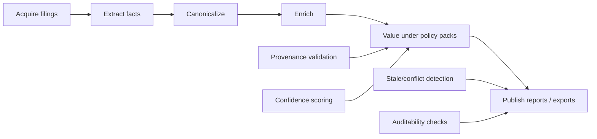
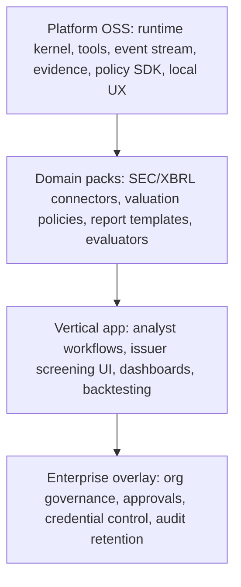

# ETL Vertical Fit

Date: 2026-03-11

## Verdict

The current repo is close enough to support a governed analytical workflow platform, but not cleanly enough yet.

What already fits:

- DAG execution
- task/workflow state handling
- event streaming
- artifact and evidence bundling
- policy pack evaluation
- local UX for inspecting runs and artifacts

What does not fit cleanly yet:

- the normative core still treats SDLC phases as the universal workflow model
- publish/release semantics assume git worktrees and PRs
- several policy and UI surfaces assume repository, PR, review, and merge as first-class concepts

The ETL vertical is therefore a strong stress test and a useful forcing function.

## ETL Placement by Layer

| ETL layer | Current fit in repo | Best destination | Notes |
|---|---|---|---|
| Acquisition orchestration | `workflow`, `dag-executor`, `tool`, `tool-registry` | `OSS-core` | Generic bounded task execution fits well |
| Extraction stage execution | `workflow`, `agent`, `tool`, `artifact` | `OSS-core` | Generic agent/tool substrate is sufficient |
| Canonicalization and enrichment flow | `workflow`, `artifact`, `evidence-bundle` | `OSS-core` | Works once stage naming is generalized |
| Valuation policy evaluation | `policy`, `gate`, `policy-pack` | `OSS-core` for SDK, `Marketplace/Paid Pack` for domain rules | Domain rules are commercial pack material |
| Confidence scoring and provenance | `event-stream`, `evidence-bundle`, `artifact` | `OSS-core` | Strong fit already |
| Publication to dashboard/report/export | `reporting` base renderer | split: `OSS-extension` renderer, `Vertical/App example` app UI, premium templates as `Marketplace/Paid Pack` | Needs non-git publish targets |
| Multi-user run control | barely implemented locally | `Enterprise/Fleet` | Current code is not multi-user or multi-tenant |
| Policy lifecycle and approvals | spec-heavy, code-light | `Enterprise/Fleet` | Do not force into OSS kernel |
| SEC/XBRL connectors | not present | `Marketplace/Paid Pack` or `Vertical/App example` | Clear premium pack candidate |
| Liquidation value policy packs | not present | `Marketplace/Paid Pack` | Strong commercial differentiation |
| Issuer screening UI / dashboards | not present | `Vertical/App example` | Product-specific application layer |

## Answers to the Required ETL Questions

### 1. Which ETL layers fit naturally inside OSS miniforge as reusable primitives?

These fit well in OSS:

- workflow/DAG execution
- task protocol and state management
- tool contract and tool registry
- artifact persistence
- evidence bundle and provenance tracing
- event stream and replay
- local policy evaluation SDK
- local run inspection UX

### 2. Which ETL layers should clearly be vertical-app code?

These should not live in the kernel:

- SEC issuer/domain ontology
- canonical financial statement schema
- liquidation value domain logic
- screening UX
- analyst workflow UX
- valuation report rendering
- backtesting dataset harnesses

### 3. Which ETL layers are likely premium packs or enterprise/Fleet features?

Premium packs:

- SEC/XBRL ingestion and parsing packs
- valuation haircut/scenario policy packs
- sector-specific override packs
- confidence downgrade/calibration packs
- reporting templates

Enterprise/Fleet:

- multi-user run governance
- approval and exception handling
- credential governance for market-data or filing connectors
- enterprise audit retention
- org-wide scheduling and cost controls

### 4. Does the current platform already have abstractions sufficient to model this ETL cleanly?

Partly.

The kernel abstractions are good enough for:

- bounded tasks
- staged pipelines
- evidence and provenance
- policy gating
- replay and monitoring

They are not yet clean enough for ETL because the default model still centers:

- SDLC phases
- git/PR release
- review/merge readiness
- repo- and file-oriented policy evaluation

### 5. If not, what missing abstractions are required?

Needed abstractions:

- generic `workflow-family` or `stage-family` model
- generic `publish` / `emit` target instead of git-only release
- dataset/table/report artifact types at the same status as code/PR artifacts
- connector/source contracts for ingestion
- typed `evaluation-result` and `confidence-result` schemas for analytical workflows
- generic trigger model for non-PR external events
- non-repo policy applicability fields for records, tables, documents, and datasets

### 6. Which existing miniforge assumptions are too software-factory-specific and would block this vertical?

Repo-backed blockers:

- `N1` and `N2` define SDLC phases as the canonical core model
- `workflow/release.clj` writes to git worktrees and stages files
- `dag-executor/state.clj` encodes PR-opening, CI, review, merge states
- `policy-pack/external.clj` centers PR diff review as a first-class evaluation path
- `tui-views` and `web-dashboard` include PR Fleet and train surfaces in their main app packages
- shipped workflows in `components/workflow/resources/workflows/` are all software-delivery oriented

### 7. What spec changes are needed to frame the platform as a workflow engine, not only a software factory?

Required spec changes:

- `N1`: redefine the platform canonically as a governed autonomous workflow engine; move the software factory to a
  reference workflow family
- `N2`: make stages generic and treat SDLC phases as one workflow family, not the core invariant
- `N5`: split local workflow UX from software-factory and Fleet extensions
- `N6`: elevate non-code artifacts and analytical outputs to first-class examples
- `N9`: move from "core extension" posture to "software-factory app extension" posture

## Current Repo Signals That ETL Is Already Trying to Exist

There are real signs in the repo that the system is broader than SDLC:

- `components/workflow/src/ai/miniforge/workflow/etl.clj` already defines an ETL workflow, though it is aimed at
  knowledge-pack generation rather than financial analytics
- `N5` includes `etl` commands and pack-oriented flows
- `N6` includes report artifacts and `:etl-report`
- `N3` includes ETL-related event shapes

But the current ETL implementation is still repo/pack-centric, not a general analytical data pipeline.

## ETL Stress Test on the Current Kernel

This maps well to the current kernel if the platform is reframed as:

- DAG/stage execution
- policy/evidence/provenance
- local-first operator experience

It maps poorly if the platform continues to assume:

- code review
- PR merge
- repo DAGs
- release-to-git

## Missing Kernel Changes for Strong ETL Fit

### 1. Generalize stages

Replace "Plan -> Design -> Implement -> Verify -> Review -> Release -> Observe" as the normative kernel with:

- generic stage nodes
- stage families
- reference family bundles

Example families:

- software-factory
- analytical-etl
- diagnostics
- org-memory

### 2. Replace git release with generic publication

Current `release` should become a generic publication contract:

- publish to git/PR
- publish to table/db
- publish to report bundle
- publish to dashboard export

### 3. Expand artifact vocabulary

First-class artifact types should include:

- dataset snapshot
- extracted fact set
- canonical record set
- policy decision record
- valuation output
- report template
- rendered report

### 4. Generalize policy applicability

Current policy rules lean toward file globs, repos, and phases. ETL needs policy targeting for:

- source type
- document type
- record type
- schema version
- scenario family
- publication channel

## Proposed ETL Layering Model

## Recommendations for ETL Placement

### Put in OSS now

- generic workflow runtime
- event stream
- evidence/provenance
- policy SDK
- local UI
- non-git publication interface

### Keep out of OSS core

- financial ontology
- SEC/XBRL extraction logic
- valuation policy packs
- premium reporting templates
- market-data connectors
- enterprise approval/credential governance

### Use ETL as the product-shaping test

Before public launch, validate that a simple ETL demo can be modeled without forcing these nouns into the kernel:

- repo
- PR
- review approval
- merge readiness
- git release

If the demo still needs those, the boundary cleanup is not done.
