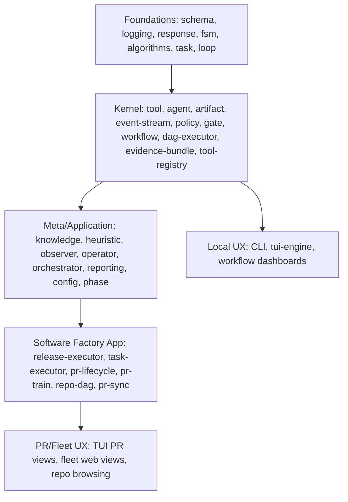

# Open-Core Boundary Review

Date: 2026-03-11

## Scope and Method

This review is based on the repo as it exists now, not on a greenfield product split. I inspected:

- Normative specs `N1` through `N10` in `specs/normative/`
- `SPEC_INDEX.md`, `readme.md`, `workspace.edn`, `deps.edn`, `bb.edn`, and `LICENSE`
- All top-level components in `components/`, bases in `bases/`, and projects in `projects/`
- Key implementation files for workflow execution, DAG execution, policy packs, event streaming, PR/Fleet features,
  TUI/web UI, and governance config

Primary repo-backed findings:

- The repo already contains a credible OSS kernel: workflow runtime, DAG executor, event stream, artifact/evidence
  model, tool substrate, policy-pack SDK, local CLI/TUI/web UX.
- The repo also contains a large amount of software-factory application code: PR lifecycle, PR trains, repo DAGs, SDLC
  workflows, release-to-git behavior, and PR-focused dashboards.
- True enterprise/Fleet capabilities are mostly specified, not fully implemented. Current code is mostly local-first
  scaffolding for those future capabilities.
- The biggest boundary problem is not "enterprise code living in OSS." It is that software-factory assumptions are
  embedded too deep in core interfaces, making the OSS platform look narrower than it should.

## Current Architecture Narrative

Current dependency pressure from `components/*/deps.edn`:

- Foundations: `schema`, `logging`, `response`, `algorithms`, `fsm`, `loop`, `task`
- Runtime kernel: `tool`, `agent`, `artifact`, `event-stream`, `policy`, `gate`, `workflow`, `dag-executor`,
  `evidence-bundle`, `tool-registry`
- Meta/application layer: `knowledge`, `heuristic`, `observer`, `operator`, `orchestrator`, `reporting`, `phase`,
  `config`
- Software-factory app layer: `release-executor`, `task-executor`, `pr-lifecycle`, `pr-train`, `pr-sync`, `repo-dag`
- UX layer: `tui-engine`, `tui-views`, `web-dashboard`, CLI base

Two repo facts matter most:

1. `workflow`, `dag-executor`, and `event-stream` are central and broadly reusable.
2. `task-executor`, `pr-lifecycle`, `pr-train`, `repo-dag`, PR-specific policy evaluation, and large parts of TUI/web UI
  are software-factory application code, not kernel code.

## 1. Current-State Inventory

### Runtime and SDK Components

| Item | Purpose | Key deps | Governance / proprietary coupling | Bucket | Recommended destination | Confidence |
|---|---|---|---|---|---|---|
| `components/schema` | Shared schemas and validation primitives | none | none | `OSS-core` | Keep public as kernel foundation | High |
| `components/logging` | Structured logging and sinks | none | none | `OSS-core` | Keep public | High |
| `components/response` | Success/failure/anomaly helpers | none | none | `OSS-core` | Keep public | High |
| `components/algorithms` | Generic algorithms helpers | none | none | `OSS-core` | Keep public | High |
| `components/fsm` | Generic state machine support | none | none | `OSS-core` | Keep public | High |
| `components/loop` | Inner/outer loop state patterns | none | SDLC language in docs, but model is general | `OSS-core` | Keep public, rename docs away from SDLC-first framing | Medium |
| `components/task` | Generic task model | none | none | `OSS-core` | Keep public | High |
| `components/tool` | Tool protocol and execution wrapper | `logging`, `schema` | Current implementation is simple; no enterprise broker logic yet | `OSS-core` | Keep public; evolve toward N10 kernel | High |
| `components/agent` | Agent protocol and specialized agent plumbing | `tool`, `response` | Mostly generic, though docs are software-factory framed | `OSS-core` | Keep public | Medium |
| `components/agent-runtime` | Error classification and runtime handling | `task` | Current classifiers are software-engineering oriented | `OSS-extension` | Keep interface public; move vendor-specific classifiers to app/examples | Medium |
| `components/artifact` | Artifact store and persistence | `schema`, `logging` | none | `OSS-core` | Keep public | High |
| `components/event-stream` | Append-only event bus, listeners, approvals, control actions | `logging`, `schema` | Listener/control logic points toward enterprise, but is local-only today | `OSS-core` | Keep core bus OSS; split listener/control interface from enterprise implementations | High |
| `components/evidence-bundle` | N6 evidence and provenance bundle creation | `artifact`, `logging`, `schema` | Compliance language exists, but implementation is local and generic | `OSS-core` | Keep public | High |
| `components/policy` | Gate evaluation and policy core | none | Minimal implementation; no enterprise authz | `OSS-core` | Keep public | High |
| `components/gate` | Gate abstractions and concrete gate helpers | `response` | none | `OSS-core` | Keep public | High |
| `components/policy-pack` | Pack schema, loader, registry, trust model, external PR evaluator | `algorithms`, `config` | Core SDK is generic; `external.clj` and signature verification stub lean commercial | `OSS-core` | Keep SDK OSS; move signed verification and entitlement hooks to enterprise; move PR-specific evaluators to app/packs | High |
| `components/tool-registry` | Tool registry, MCP/LSP config, schema | `logging`, `schema` | Repo intelligence and MCP bindings are generic enough; no entitlement logic yet | `OSS-core` | Keep public | High |
| `components/dag-executor` | DAG scheduler, state machine, backends for worktree/docker/k8s | `task`, `loop`, `logging`, `schema`, `agent`, `artifact` | Interface is reusable, but task states are PR lifecycle specific | `OSS-core` | Keep scheduler OSS; split git/PR task model into software-factory app module | High |
| `components/workflow` | Main workflow runner, persistence, loading, chaining, DAG orchestration | many kernel deps | Core runner is reusable, but default phases, release, triggers, and docs are SDLC-specific | `OSS-core` | Keep engine OSS; split phase catalog and SDLC workflows into app/examples | High |
| `components/mcp-artifact-server` | MCP-facing artifact access | `cheshire` | none | `OSS-extension` | Keep public as ecosystem adapter | Medium |

### Meta, Config, and Learning Components

| Item | Purpose | Key deps | Governance / proprietary coupling | Bucket | Recommended destination | Confidence |
|---|---|---|---|---|---|---|
| `components/config` | Local config loading; governance config overlays | external libs | Contains PR-risk/readiness/tier configs that are app/policy assets, not kernel | `Unclear / needs redesign` | Keep generic config OSS; move shipped PR governance profiles to packs or app repo | High |
| `components/knowledge` | Knowledge pack loading and trust-aware content handling | `algorithms`, `schema`, `logging` | Generic in principle, but current use is repo/code oriented | `OSS-extension` | Keep public with neutral naming and examples | Medium |
| `components/heuristic` | Heuristic storage/versioning | none | Generic, but currently tied to meta-loop workflow evolution | `OSS-extension` | Keep public | Medium |
| `components/observer` | Workflow observation and knowledge integration | `workflow`, `artifact`, `knowledge` | Mostly platform-level, but presently tied to workflow/meta-loop | `OSS-extension` | Keep public, simplify surface | Medium |
| `components/operator` | Pattern detection / meta-loop operator | `workflow`, `knowledge`, `logging`, `schema` | This is the start of a learning loop; currently not enterprise-grade but part of long-term moat | `Unclear / needs redesign` | Split signal/pattern interfaces OSS, move improvement policy engines private or to paid packs | Medium |
| `components/orchestrator` | Higher-level orchestration | `workflow`, `knowledge`, `llm`, `artifact`, `logging`, `schema` | Thin but directionally part of higher-level product intelligence | `Unclear / needs redesign` | Reduce to generic orchestration ports in OSS; move strategy logic out | Medium |
| `components/reporting` | Workflow-oriented reports and views | `workflow`, `orchestrator`, `operator`, `artifact`, `logging`, `schema` | Current reporting is product UX, not kernel | `OSS-extension` | Keep reference reporting OSS; premium templates belong in marketplace | Medium |
| `components/self-healing` | Backend health and workaround approvals | external libs | Local operational helper; could become enterprise observability later | `OSS-extension` | Keep local runtime resilience OSS | Medium |
| `components/spec-parser` | Parse workflow specs into normalized input | external libs | Currently aimed at software-factory spec files | `Vertical/App example` | Move under software-factory app layer or rename as generic workflow-intake parser | High |
| `components/phase` | Concrete plan/implement/verify/review/release interceptors | none | Hard-coded SDLC concepts | `Vertical/App example` | Move to software-factory reference app | High |
| `components/llm` | LLM client integration | `logging` | Generic substrate | `OSS-core` | Keep public | High |

### Software-Factory and Fleet-App Components

| Item | Purpose | Key deps | Governance / proprietary coupling | Bucket | Recommended destination | Confidence |
|---|---|---|---|---|---|---|
| `components/release-executor` | Release and artifact handoff for code workflows | `workflow`, `artifact`, `dag-executor`, `logging` | Git/PR release semantics | `Vertical/App example` | Move to software-factory app repo/package | High |
| `components/task-executor` | Runs DAG tasks through code -> PR lifecycle | `dag-executor`, `pr-lifecycle`, `agent-runtime`, `event-stream` | Explicit GitHub token / PR lifecycle coupling | `Vertical/App example` | Move to software-factory app repo/package | High |
| `components/pr-lifecycle` | PR creation / CI / review / merge lifecycle | `dag-executor`, `release-executor`, `loop`, `agent`, `artifact` | Strong software-factory and provider coupling | `Vertical/App example` | Move to software-factory app; interface may stay public if positioned as reference app | High |
| `components/pr-train` | Ordered PR train management | `config`, `schema` | Product UX and governance logic for repo fleets | `Vertical/App example` | Keep as software-factory app module; not kernel | High |
| `components/pr-sync` | Repo/PR discovery via `gh` and `glab` | `cheshire` | Provider-specific and multi-repo management oriented | `Vertical/App example` | Move to software-factory app or provider adapter package | High |
| `components/repo-dag` | Repository dependency graph and merge order | `malli` | Generic graph code but domain model is repository topology | `Vertical/App example` | Move to software-factory app; or generalize into `asset-dag` before keeping OSS | High |
| `components/pr-decompose` | PR decomposition logic under test files only | orphaned | Not wired as a component; domain-specific | `Unclear / needs redesign` | Either formalize as software-factory pack or remove from public repo before launch | High |

### UX, Bases, and Projects

| Item | Purpose | Key deps | Governance / proprietary coupling | Bucket | Recommended destination | Confidence |
|---|---|---|---|---|---|---|
| `components/tui-engine` | Generic terminal UI rendering engine | lanterna only | none | `OSS-core` | Keep public | High |
| `components/tui-views` | App TUI views | `pr-train`, `policy-pack`, `orchestrator`, `llm` | Mixed: artifact/workflow browsing is general, PR Fleet and train views are app-specific | `Unclear / needs redesign` | Split into `tui-views-core` and `tui-views-software-factory` | High |
| `components/web-dashboard` | Local web dashboard | http-kit, hiccup, json | Mixed: workflow/evidence/artifact views are general; fleet/train views are app-specific | `Unclear / needs redesign` | Split into `web-console-core` and `web-console-software-factory` | High |
| `bases/cli` | Main CLI entrypoint and web handlers | bundled libs | Mixed: generic workflow commands plus Fleet and PR commands | `Unclear / needs redesign` | Split CLI namespaces into kernel vs app vs enterprise plugins | High |
| `bases/lsp-mcp-bridge` | LSP/MCP bridge entry point | none | Generic code-intelligence adapter; useful beyond enterprise | `OSS-extension` | Keep public | Medium |
| `projects/miniforge` | Main composed app/test harness | many deps | Contains both kernel and app composition | `Unclear / needs redesign` | Turn into software-factory reference app project; create a smaller kernel project | High |
| `projects/miniforge-tui` | TUI distribution project | many deps | Same issue: bundles kernel plus PR/Fleet app surfaces | `Unclear / needs redesign` | Publish a `miniforge-core` CLI/TUI and a separate software-factory app distribution | High |

### Workflows, Policies, Config Assets, and Specs

| Item | Purpose | Key deps / references | Governance / proprietary coupling | Bucket | Recommended destination | Confidence |
|---|---|---|---|---|---|---|
| `components/workflow/resources/workflows/*.edn` | Built-in workflow definitions | workflow engine | All shipped workflows are SDLC-centric | `Vertical/App example` | Move to software-factory reference workflows package | High |
| `examples/workflows/*` | Example specs and demos | CLI/spec parser/workflow | Mostly software-factory examples | `Vertical/App example` | Keep public, but add non-software examples beside them | High |
| `resources/config/workflow-registry.edn` | Built-in workflow catalog | workflow loader | Lists only SDLC/test workflows | `Vertical/App example` | Move to software-factory app repo or app package | High |
| `components/config/resources/config/governance/readiness.edn` | PR readiness scoring | config/governance | Pure PR-governance heuristic asset | `Marketplace/Paid Pack` | Move to software-factory governance pack; ship a minimal OSS example instead | High |
| `components/config/resources/config/governance/risk.edn` | PR risk scoring | config/governance | Pure PR-governance heuristic asset | `Marketplace/Paid Pack` | Move to software-factory governance pack | High |
| `components/config/resources/config/governance/tiers.edn` | Automation tiers for PR/Fleet behavior | config/governance | Governance policy asset, not kernel | `Enterprise/Fleet` | Move to Fleet policy repo or enterprise defaults | High |
| `components/config/resources/config/governance/knowledge-safety.edn` | Prompt/pack safety patterns | config/governance | General enough for OSS, though could have premium variants later | `OSS-extension` | Keep public with explicit extensibility | Medium |
| `specs/normative/N1` | Core architecture and boundaries | all specs | Valuable OSS contract, but still software-factory first | `OSS-core` | Keep public, revise platform framing and split app examples from kernel nouns | High |
| `specs/normative/N2` | Workflow model | workflow engine | Uses fixed SDLC phases as normative core | `Unclear / needs redesign` | Keep public but generalize stage families; move SDLC workflow family to reference app appendix | High |
| `specs/normative/N3` | Event stream contract | event-stream | Strong OSS value; some enterprise event types can remain as optional extensions | `OSS-core` | Keep public | High |
| `specs/normative/N4` | Policy packs and gates | policy-pack | OSS SDK value is high; authz/approval rules belong in enterprise overlays | `OSS-core` | Keep public, split advanced enterprise controls into companion extension spec | High |
| `specs/normative/N5` | CLI/TUI/API | CLI/TUI/web | Mixes local UX with Fleet/OCI/N9 management | `Unclear / needs redesign` | Split kernel UX spec from enterprise/app command namespaces | High |
| `specs/normative/N6` | Evidence and provenance | evidence-bundle | Strong OSS value; compliance retention/export can be enterprise | `OSS-core` | Keep public | High |
| `specs/normative/N7` | OPSV / runtime fleet policy synthesis | future Fleet capability | High monetization leverage, high ops burden | `Enterprise/Fleet` | Move to private enterprise repo or publish as source-available extension later | High |
| `specs/normative/N8` | Observability Control Interface | event-stream control | Local observe/control subset is OSS-friendly; RBAC/multi-tenant parts are enterprise | `Enterprise/Fleet` | Split into OSS listener API + enterprise control/governance extension | High |
| `specs/normative/N9` | External PR integration | PR/Fleet app | Flagship app capability, not kernel | `Vertical/App example` | Keep as software-factory app spec, not core platform spec | High |
| `specs/normative/N10` | Governed tool execution | tool substrate | Kernel model is OSS-worthy; capability broker and credential governance are enterprise | `OSS-core` | Keep core spec public; private broker/credential implementations | High |

## 2. Boundary Decision Matrix

| Subsystem | Primitive? | Governance / control plane? | Domain workflow or pack? | Product UX / enterprise management? | Data flywheel / learning asset? | Recommendation | Why |
|---|---|---|---|---|---|---|---|
| `workflow` engine | Yes | No | No | No | Partial | Keep OSS | Highest adoption and cross-vertical reuse; low moat exposure if phase catalog is separated |
| `dag-executor` scheduler | Yes | No | No | No | No | Keep OSS after state-model split | Very reusable across ETL, diagnostics, repo workflows |
| `tool` + `tool-registry` | Yes | Partial | No | No | Partial | Keep OSS | Essential SDK surface; marketplace needs a public tool contract |
| `artifact` + `evidence-bundle` | Yes | Partial | No | No | Yes | Keep OSS | Critical trust primitive for all verticals; more adoption upside than moat risk |
| `event-stream` core | Yes | Partial | No | No | Yes | Keep OSS | Foundational for local UX, replay, analytics, third-party ecosystem |
| listener/control model in `event-stream` | Partial | Yes | No | Yes | Yes | Split interface OSS / implementation enterprise | Local pause/resume can be OSS; RBAC, approvals, multi-tenant routing should not be |
| `policy` + `policy-pack` SDK | Yes | Partial | No | No | Partial | Keep OSS; split advanced verification/commercial delivery | Public SDK is needed for marketplace and ecosystem growth |
| pack signature verification | No | Yes | No | Yes | No | Move to enterprise | Direct monetization lever and commercial distribution control |
| `phase` interceptors | No | No | Yes | No | No | Move to software-factory app | These encode SDLC policy and terminology as if universal |
| shipped SDLC workflows | No | No | Yes | No | No | Move to reference app/examples | Good demos, not kernel |
| `release-executor` | No | No | Yes | No | No | Move to software-factory app | Git worktree and PR staging are software-delivery specific |
| `task-executor` | No | No | Yes | No | Partial | Move to software-factory app | Hard-coded PR lifecycle and GitHub token flow |
| `pr-lifecycle` / `pr-train` / `repo-dag` / `pr-sync` | No | Partial | Yes | Yes | Yes | Move to software-factory app; keep provider-neutral interfaces if useful | Strong flagship-app value, but not generic governed workflow kernel |
| `knowledge` / `heuristic` | Partial | No | No | No | Yes | Keep OSS-extension | Reusable, but must shed codebase-centric assumptions |
| `operator` / `orchestrator` | Partial | Partial | No | No | Yes | Split | Thin OSS interfaces OK; improvement strategies and org-learning logic are moat-sensitive |
| `reporting` | Partial | No | Partial | Yes | Yes | Keep base renderer OSS; premium templates to marketplace | Good ecosystem surface, low-risk base layer |
| `tui-engine` | Yes | No | No | No | No | Keep OSS | Clear local-first adoption surface |
| `tui-views` / `web-dashboard` | Partial | Partial | Partial | Yes | No | Split core console OSS / software-factory views app / enterprise control panels private | Current modules mix all three concerns |
| `bases/cli` | Partial | Partial | Partial | Yes | No | Split commands by package | Needed for public product clarity |
| N7 OPSV | No | Yes | Yes | Yes | Yes | Move to enterprise | High ops/support burden, strong monetization, limited adoption value as core contract |
| N8 full OCI | Partial | Yes | No | Yes | Yes | Split | Public observe/advice APIs help ecosystem; RBAC/tenant features do not |
| N9 external PR integration | No | Partial | Yes | Yes | Yes | Reframe as flagship app spec | Good app story, weak fit as kernel spec |
| N10 governed tool execution | Yes | Partial | No | Partial | Yes | Keep OSS kernel, private enterprise overlays | Needed for domain-neutral platform credibility |

### Decision Criteria Summary

- Adoption value is highest for local runtime primitives, evidence/provenance, eventing, SDKs, and local UX.
- Moat exposure is highest for org-wide governance lifecycle, approvals, identity, control-plane routing, entitlement
  delivery, and cross-org learning loops.
- Operational complexity and support burden spike for distributed scheduling, RBAC/SSO, long-term audit retention,
  marketplace entitlements, and fleet analytics.
- Monetization leverage is strongest in Fleet governance, commercial pack distribution, premium evaluators, and vertical
  packs.
- Composability across verticals is strongest in the kernel and weakest in repo/PR-specific workflow code.
- Licensing risk is highest if premium heuristics, signed pack verification, entitlement plumbing, or enterprise authz
  land in Apache-licensed OSS before boundaries are cleaned up.

## 3. Architectural Fault Lines

| Fault line | Repo evidence | Extraction boundary | Migration approach | Backward compatibility |
|---|---|---|---|---|
| SDLC phases treated as normative kernel | `N1`, `N2`, `workflow.interface`, `phase/*`, shipped workflow EDN files | Introduce generic `stage` / `workflow-family` model in kernel; move `software-factory` phase catalog to reference app | First add aliases, then mark SDLC phase sequence as reference family | Preserve current phase keywords as a reference workflow family |
| Workflow release path assumes git worktree output | `workflow/release.clj`, `release-executor`, `task-executor` | Replace `release` with generic `publish`/`emit` adapter contract | Add adapter interface in OSS, reimplement git/PR publish in software-factory app | Support existing `:release` phase via adapter shim |
| DAG task state machine encodes PR lifecycle | `dag-executor/state.clj`, `scheduler.clj` | Split scheduler kernel from task-state profiles | Introduce generic node-state contract plus software-factory profile | Keep current statuses as one bundled profile |
| Policy pack SDK mixed with external PR evaluation | `policy-pack/external.clj`, interface `evaluate-external-pr` | Move PR diff evaluation into software-factory pack/evaluator package | Keep public wrapper temporarily, delegate to moved package if present | Deprecate PR-specific entrypoints over a release or two |
| Fleet/control concepts mixed into event-stream component | `event-stream/listeners.clj`, `control.clj`, `approval.clj` | Keep event bus OSS; move RBAC, approval policy, multi-tenant routing to Fleet repo | Define ports for authorizer, approval store, control dispatcher | Default local implementation remains OSS for single-user mode |
| Governance config ships product-specific PR heuristics in core config | `components/config/resources/config/governance/*.edn` | Move policy assets to packs; keep loader generic | Introduce `pack/config-overrides` source-of-truth and stop shipping PR-specific defaults in kernel | Bundle a tiny OSS example pack for migration |
| TUI/web modules mix generic run inspection with PR Fleet UI | `tui-views/*`, `web-dashboard/views/fleet.clj` | Split core workflow console from software-factory views | Move PR views into app package, keep shared primitives and artifact/workflow views | Existing CLI can load app plugin when installed |
| Learning loop code mixed into OSS runtime composition | `operator`, `orchestrator`, `reporting` | Extract signal/event interfaces from improvement policy engines | Keep generic signal store/pattern protocol in OSS, move auto-improvement strategies out | Leave thin wrappers that no-op when enterprise modules absent |
| Trigger model assumes PR-merge event as first-class | `workflow/trigger.clj` | Generalize triggers around typed external events | Introduce generic trigger predicates and adapters | Keep `create-merge-trigger` as convenience helper |
| Repo-specific ETL mislabeled as general ETL | `workflow/etl.clj`, N5 `etl` commands | Recast as `pack-etl` or `knowledge-pack-etl`; add general data-pipeline abstractions elsewhere | Keep file but rename and scope it | Backward alias from old namespace |

## What Currently Reveals Too Much of the Long-Term Moat

The riskiest OSS leaks are not the obvious PR screens. They are the pieces that could harden into commercial control:

- Shipped governance scoring assets for readiness/risk/tiering in `components/config/resources/config/governance/`
- Signed pack verification hooks in `policy-pack.registry` and schema comments
- Control action, approval, and listener capability scaffolding inside `event-stream`
- Early operator/orchestrator/reporting learning-loop composition, which is the seed of the data flywheel

These should not all become private immediately, but they should stop being treated as inseparable parts of the kernel.

## Concise Recommendation

Open source now:

- Runtime kernel: workflow runner, DAG scheduler, event stream, tool substrate, artifact/evidence model, policy-pack
  SDK, local CLI/TUI/web console primitives
- Local-first adapters: filesystem artifact store, worktree/docker/k8s execution adapters, MCP/LSP tooling, local
  safety/knowledge helpers
- Reference apps and examples: a clearly labeled software-factory app package plus new non-code examples

Do not treat as OSS core:

- PR lifecycle, PR trains, repo DAGs, release-to-git behavior, PR sync, SDLC phase catalog, and PR-governance configs
- RBAC, multi-party approvals, multi-tenant listeners, control-plane routing, org analytics, policy distribution,
  entitlements

Key structural move:

- Reframe miniforge as an OSS governed autonomous workflow platform, with the autonomous software factory as the first
  flagship application built on top of it.
