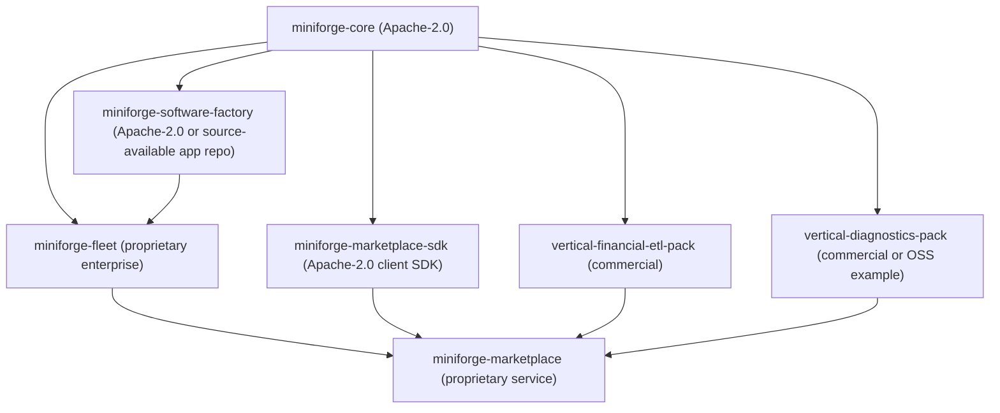

# Repo Split Proposal

Date: 2026-03-11

## Executive Position

The clean split is:

- `miniforge-core` = OSS governed workflow kernel and SDK
- `miniforge-software-factory` = flagship OSS reference app built on that kernel
- `miniforge-fleet` = proprietary enterprise control plane
- `miniforge-marketplace` = pack distribution and entitlement layer
- vertical packs/apps = separate repos or packages, commercial when differentiated

This matches both the code and the monetization surface better than the current single-repo/product identity.

## 4. Proposed Open-Core Product Split

### OSS

Keep public as the stable platform:

- Local runtime kernel
  - `workflow` engine after phase-family split
  - `dag-executor` after node-state split
  - `event-stream` core
  - `artifact`, `evidence-bundle`
  - `tool`, `tool-registry`, `agent`, `llm`, `task`, `loop`, `fsm`
- Policy and evaluation SDK
  - `policy`, `gate`, `policy-pack` core loader/registry/schema
  - generic trust metadata and local evaluation
- Local operator experience
  - CLI workflow commands
  - `tui-engine`
  - workflow/artifact/evidence web and TUI views
- Reference integrations
  - worktree/docker/k8s execution adapters
  - MCP artifact server
  - LSP/MCP bridge
- Reference workflows and demos
  - a small software-factory sample set
  - at least one non-code workflow family

### Enterprise / Fleet

Keep private:

- Org-wide control plane
  - distributed scheduling
  - multi-instance orchestration
  - queueing, routing, capacity control
- Governance engine
  - policy lifecycle management
  - approvals and exceptions
  - policy rollout and mandatory gate enforcement
- Security and identity
  - SSO/SAML/OIDC
  - RBAC/ABAC
  - tenant isolation
  - credential governance and capability broker
- Enterprise observability and audit
  - long-term audit retention
  - compliance exports
  - org-level dashboards and forensics
  - cost accounting and usage analytics
- Commercial delivery
  - entitlement checks
  - private pack feeds
  - license enforcement and billing hooks

### Paid / Marketplace

Package as commercial packs or templates:

- Premium policy packs
  - advanced software-governance packs
  - regulated-domain approval packs
- Premium workflows
  - sophisticated review/remediation flows
  - calibration/backtesting loops
- Premium reporting
  - executive dashboards
  - compliance report templates
- Premium evaluators
  - advanced risk/readiness scorers
  - high-value domain evaluators

### Vertical Apps / Examples

Separate from the kernel:

- Autonomous software factory
  - PR lifecycle
  - PR trains
  - repo DAG
  - SDLC phase packs
- Financial filings liquidation ETL
- Service diagnostics / incident workflows
- Organizational memory workflows
- Repo governance / PR trains as a packaged app

## Recommended Repo Topology

### Concrete Repo / Module Mapping

| Target repo / package | Contents from current repo | Notes |
|---|---|---|
| `miniforge-core` | `schema`, `logging`, `response`, `algorithms`, `fsm`, `loop`, `task`, `tool`, `agent`, `llm`, `artifact`, `event-stream`, `policy`, `gate`, `policy-pack` core, `tool-registry`, generic parts of `workflow`, generic parts of `dag-executor`, `evidence-bundle`, `tui-engine`, local workflow/evidence/artifact UX | This is the real OSS product |
| `miniforge-software-factory` | `phase`, shipped SDLC workflows, `release-executor`, `task-executor`, `pr-lifecycle`, `pr-train`, `pr-sync`, `repo-dag`, PR-specific policy evaluators, PR/Fleet UI views, software-factory examples, spec parser if left app-specific | Flagship app, still allowed to be OSS if desired |
| `miniforge-fleet` | distributed fleet daemon, RBAC/authz, approval policy engine, multi-tenant listeners, org analytics, policy distribution, entitlement enforcement | Mostly not implemented here yet; specs point this way |
| `miniforge-marketplace-sdk` | pack install/update client, local cache, signature plumbing interface | Public side of the commercial ecosystem |
| `miniforge-marketplace` | pack registry service, entitlements, billing, signed delivery | Private service |
| `miniforge-vertical-financial-etl` | SEC/XBRL connectors, canonical financial schema, valuation policies, dashboard/report templates, calibration harnesses | Commercial vertical candidate |

## Recommended Package and API Boundaries

### OSS API Surface

Keep these packages small and stable:

- `miniforge.workflow.*`
  - generic DAG/stage execution
  - generic chaining
  - persistence and replay
- `miniforge.runtime.*`
  - artifact store
  - event stream
  - evidence bundle
  - tool execution and registry
- `miniforge.policy.*`
  - gate result schema
  - policy pack schema
  - evaluator interface
  - provenance and explainability result schemas
- `miniforge.ui.*`
  - CLI/TUI/web primitives
  - run inspection
  - artifact/evidence browsing

### Software-Factory App API Surface

- `miniforge.software-factory.workflow-family`
- `miniforge.software-factory.release`
- `miniforge.software-factory.pr-lifecycle`
- `miniforge.software-factory.repo-dag`
- `miniforge.software-factory.trains`
- `miniforge.software-factory.ui`

### Enterprise / Fleet API Surface

- `fleet.control-plane`
- `fleet.policy-lifecycle`
- `fleet.identity`
- `fleet.audit`
- `fleet.marketplace.entitlements`

### Marketplace API Surface

- `pack.sdk`
  - install
  - inspect
  - verify
  - dependency resolution
- `pack.registry`
  - discovery
  - entitlements
  - signed delivery

## 5. License and Distribution Recommendations

### Recommended licensing

- OSS kernel: Apache 2.0
- Software-factory reference app:
  - Apache 2.0 if the goal is maximum adoption and category creation
  - source-available if you want stronger product differentiation around the flagship app
- Enterprise/Fleet repo: proprietary
- Marketplace-delivered premium packs: proprietary or source-available per pack

### Why Apache 2.0 still works for the kernel

Apache 2.0 is a good fit for:

- workflow runtime
- event stream
- evidence model
- pack SDK
- local UI
- adapters and public schemas

Those are ecosystem-multiplying assets. Locking them down would reduce adoption more than it would protect monetization.

### Where permissive licensing becomes strategically risky

Avoid putting these in Apache-licensed OSS before the split is clean:

- org-wide governance policies
- entitlement logic
- commercial signature verification service logic
- advanced PR risk/readiness heuristics if they are a commercial differentiator
- calibration/backtesting data or high-value evaluators
- distributed Fleet analytics and cross-org learning loops

### Source-available overlays

If you want a middle layer between OSS and closed enterprise, the best candidates are:

- software-factory app bundles
- premium policy packs
- premium report templates
- vertical evaluators

Do not make the kernel source-available. That muddies the story and weakens ecosystem growth.

## 6. Migration Plan

### Phase 1

Goal: prevent the public repo from implying that app and enterprise concerns are the core product.

Code moves:

- Reclassify current repo internally into `core` vs `software-factory`
- Move PR governance config assets out of `components/config/resources/config/governance/` into app/packs
- Move PR/Fleet views under app-specific namespaces
- Rename `workflow/etl.clj` to `pack_etl.clj` or similar

Spec changes:

- Revise `N1` and `N2` so the kernel is workflow-platform first
- Move `N9` out of the "core identity" story and label it as a flagship app extension
- Split `N5` into local OSS UX vs app/Fleet extensions

Release impacts:

- No runtime breakage if aliases are left in place
- Better OSS messaging immediately

Risks:

- Docs and examples may lag behind namespace moves
- Users may rely on current PR/Fleet paths

Tests needed:

- loader and alias compatibility tests
- CLI namespace smoke tests
- UI route smoke tests after view split

### Phase 2

Goal: establish clean interfaces so kernel and app can version independently.

Code moves:

- Extract generic stage-family API from `workflow`
- Extract generic node-state profile API from `dag-executor`
- Introduce `publish` adapter to replace git-specific `release` assumptions
- Move PR evaluator logic out of `policy-pack`
- Split `tui-views` and `web-dashboard` into core vs app modules

Spec changes:

- Generalize stage model in `N2`
- Generalize publish/emit model in `N1` and `N6`
- Split `N8` into public listener API and private enterprise governance extension

Release impacts:

- Likely one breaking OSS release unless aliases are carefully maintained

Risks:

- Over-abstracting too early
- Regressions in current software-factory flow

Tests needed:

- kernel conformance tests decoupled from PR lifecycle
- app integration tests for software-factory workflows
- cross-package event/evidence compatibility tests

### Phase 3

Goal: enable clean marketplace and enterprise packaging.

Code moves:

- Publish `miniforge-core`
- Publish `miniforge-software-factory`
- Stand up `miniforge-fleet` private repo implementations behind OSS interfaces
- Add marketplace client SDK and pack-install flow

Spec changes:

- Add marketplace distribution spec outside kernel
- keep enterprise implementation details out of OSS normative core

Release impacts:

- New install story:
  - `miniforge-core`
  - optional software-factory package
  - optional enterprise Fleet backend

Risks:

- Version skew between kernel, app, and enterprise repos
- Pack signing and entitlement UX may be immature at first

Tests needed:

- compatibility matrix tests across package versions
- pack install/update/rollback tests
- enterprise adapter contract tests

## 7. Final Recommendation

Open source now:

- The governed workflow kernel and SDK
- Local-first event/evidence/policy/tooling substrate
- Local operator UX
- A small, clearly labeled software-factory reference app

Delay:

- distributed Fleet
- multi-tenant identity and RBAC
- approval governance and exception workflow engine
- entitlement and paid-pack delivery
- org-wide analytics and long-term audit retention

Remove or move before broad public launch:

- shipped PR readiness/risk/tier configs from kernel config paths
- PR-specific evaluators from `policy-pack` core
- PR/Fleet UI from generic UI packages
- any docs that still imply software delivery is the only supported domain

Reposition as paid packs:

- advanced software-governance packs
- financial ETL packs
- reporting templates
- specialized evaluators and calibration loops

Reframe as Fleet:

- the enterprise governed control plane above the OSS workflow engine, not the identity of the OSS product itself
