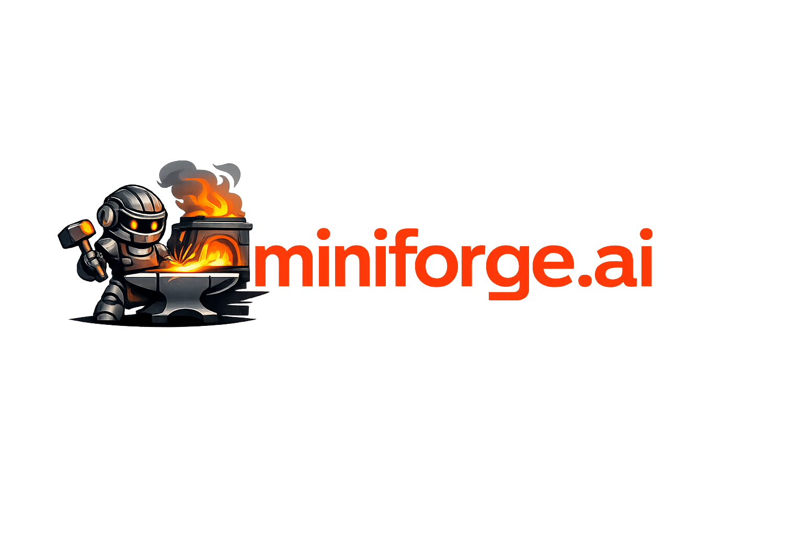

<!--
  Title: Miniforge.ai
  Author: Christopher Lester (christopher@miniforge.ai)
  Copyright 2025-2026 Christopher Lester. Licensed under Apache 2.0.
-->



# Miniforge

Write a spec. Get a pull request.

Miniforge is an autonomous software factory. You describe what you want — in
plain English or structured EDN — and miniforge plans the work, writes the code,
runs the tests, reviews itself, and opens a PR. No prompt engineering. No
copy-paste. Full SDLC.

## Before and After

```text
BEFORE                              AFTER
──────                              ─────
1. Write a ticket                   1. Write a spec
2. Create a branch                  2. mf run spec.edn
3. Read the codebase                3. Review the PR
4. Write code                       4. Merge
5. Run tests
6. Fix failures
7. Lint
8. Fix lint
9. Commit
10. Push
11. Open PR
12. Write PR description
13. Wait for CI
14. Wait for review
15. Address feedback
16. Re-push
17. Wait for re-review
18. Merge
```

## How It Works

Miniforge runs four nested control loops — a team of agents does the work,
a tight inner loop enforces quality at every step, a monitor resolves
reviewer feedback after delivery, and meta-agents govern the whole operation.

**Team loop** — specialized agents collaborate through phases, like a dev team
handing off work:

```text
Spec ──► Explore ──► Plan ──► Implement ──► Verify ──► Review ──► Release ──► Observe
           │            │           │            │           │          │          │
           │            │           │            │           │          │          └─ monitors PR:
           │            │           │            │           │          │             polls comments,
           │            │           │            │           │          │             fixes feedback,
           │            │           │            │           │          │             merges when ready
           │            │           │            │           │          │
           │            │           │            │           │          └─ creates branch,
           │            │           │            │           │             commits, opens PR
           │            │           │            │           │
           │            │           │            │           └─ self-reviews diff
           │            │           │            │              against spec + constraints
           │            │           │            │
           │            │           │            └─ gates: syntax, lint,
           │            │           │               no-secrets, tests-pass
           │            │           │
           │            │           └─ generates code via LLM agent
           │            │
           │            └─ decomposes spec into a task DAG
           │               with dependencies and parallel execution
           │
           └─ scans codebase, loads relevant files,
              queries knowledge base
```

**Inner loop** — inside each phase, the agent generates an artifact, validates
it against policy gates, and repairs failures automatically:

```text
generate ──► validate ──► [pass] ──► next phase
                │
                └─ [fail] ──► repair ──► re-validate
                                 │
                                 └─ [budget exhausted] ──► escalate
```

**Observe loop** — after Release creates a PR, the monitor loop runs
autonomously for up to 72 hours:

```text
poll PR ──► classify comments ──► route
               │                     │
               ├─ change request ──► fix, push, reply
               ├─ question ──────► answer, reply
               ├─ approval ──────► attempt merge
               └─ noise ─────────► skip
```

**Meta loop** — governance meta-agents supervise the entire operation at a
semantic level. Any meta-agent can halt the factory floor:

```text
┌─────────────────────────────────────────────────┐
│              Meta-Agent Coordinator              │
│                                                  │
│  Progress Monitor ─── stagnation? ──► halt       │
│  Test Quality ─────── coverage? ───► halt        │
│  Conflict Detector ── diverged? ───► halt        │
│  Resource Manager ─── over budget? ► halt        │
│  Evidence Collector ── (observe only, no halt)   │
│                                                  │
│  Any agent can halt. Decisions are observable.   │
└─────────────────────────────────────────────────┘
```

Policy gates govern every transition. Budget limits (tokens, cost, time)
enforce hard stops. All decisions produce evidence bundles for traceability.

## Quickstart

### Prerequisites

- macOS, Linux, or Windows — see [Platform Support](docs/platform-support.md)
  for the install path on each. Native Windows is in beta; WSL2 and Git Bash
  are first-class today.
- [Babashka](https://github.com/babashka/babashka#installation) (Mac/Linux:
  Homebrew or `bash <(curl …) --static`; Windows: `scoop install babashka`)
- An LLM backend: [Claude Code](https://claude.ai/claude-code) CLI,
  [Codex](https://openai.com/codex) CLI, or an API key (Anthropic/OpenAI)
- An OCI-compatible local container runtime (see below). [Podman](https://podman.io/)
  is the recommended default; [Docker](https://www.docker.com/) is supported.
  Other Docker-CLI hosts (Colima, OrbStack) work as `:runtime-kind :docker`.

### Install and Run

```bash
git clone https://github.com/miniforge-ai/miniforge.git
cd miniforge
bb bootstrap

# If using an API key (not needed if Claude Code or Codex CLI is installed)
# export ANTHROPIC_API_KEY="sk-ant-..."

# Run your first workflow
mf run examples/workflows/simple-refactor.edn
```

`bb bootstrap` installs the development dependencies (Java, Clojure CLI,
clj-kondo, Polylith, markdownlint), configures the repo, prefetches the
coverage tool used by `bb ccov`, and on macOS brew-installs Podman and
initializes a default `podman machine`. Linux users install Podman via
their distro package manager (`apt install podman`, `dnf install podman`,
etc.); Docker users can stay on Docker by setting
`MINIFORGE_RUNTIME=docker` or `:runtime-kind :docker` in config.

To check the resolved runtime: `mf doctor` (which now reports the
selected runtime + version + override hint) or `mf runtime info`
(prints the descriptor as data).

See the [Quickstart Guide](docs/quickstart.md) for a detailed walkthrough.

### Write a Spec

A spec is a description of what you want. Two fields are required:

```clojure
{:spec/title "Add input validation to the signup form"

 :spec/description
 "The signup form accepts any input without validation. Add server-side
  validation for email format, password strength (min 8 chars, 1 number),
  and username uniqueness. Return structured error messages."

 :spec/intent {:type :feature
               :scope ["src/auth/signup.clj"]}

 :spec/constraints
 ["No breaking changes to existing API"
  "All existing tests must pass"]

 :spec/acceptance-criteria
 ["Email validation rejects malformed addresses"
  "Password validation enforces minimum requirements"
  "Username uniqueness check queries the database"
  "Error messages are structured maps, not strings"]}
```

Specs can also be written as Markdown with YAML frontmatter. See
[Writing Specs](docs/user-guide/writing-specs.md).

### Run the Demo

```bash
# Watch miniforge improve itself (dogfooding demo)
bash examples/demo/run-demo.sh
```

The demo is a Bash script. On native Windows, run it from Git Bash or WSL2 —
or invoke the underlying workflow directly with `mf run
examples/demo/add-utility-function.edn`. See [Platform
Support](docs/platform-support.md) for details.

See [Demo Guide](docs/demo.md) for a guided walkthrough.

## Workflow Types

| Workflow | Phases | Use For |
|----------|--------|---------|
| **Canonical SDLC** | explore, plan, implement, verify, review, release, observe | Features, refactors, bug fixes |
| **Quick Fix** | implement, verify, done | Small, well-understood changes |

The workflow is selected automatically from the spec's intent, or overridden
with `:workflow/type :quick-fix`. Canonical SDLC includes the full observe
loop — the PR monitor will autonomously address reviewer feedback after release.

## Configuration

```bash
# LLM backend: auto-detected from installed CLIs
# Claude Code or Codex CLI are used automatically if installed.
# Otherwise, set an API key:
export ANTHROPIC_API_KEY="sk-ant-..."
# Or:
export OPENAI_API_KEY="sk-..."

# Tune execution
export MINIFORGE_MAX_ITERATIONS=50     # max phase retries
export MINIFORGE_MAX_TOKENS=150000     # token budget per workflow
```

See [Configuration Guide](docs/user-guide/configuration.md) for all options.

## Architecture

Miniforge is built on a governed workflow engine with pluggable phases, agents,
and policy packs:

```text
┌─────────────────────────────────────────────────────┐
│             CLI / TUI / Web Dashboard                │
├─────────────────────────────────────────────────────┤
│  Meta Loop: Governance (can halt at any point)       │
│  Progress · Test Quality · Conflicts · Resources     │
├─────────────────────────────────────────────────────┤
│  Team Loop: Workflow Engine (phase state machine)    │
│  ┌──────┐ ┌──────┐ ┌───────┐ ┌──────┐ ┌─────────┐  │
│  │Explore│ │ Plan │ │Implmnt│ │Verify│ │ Release │  │
│  └──────┘ └──────┘ └───────┘ └──────┘ └─────────┘  │
│              ↕           ↕         ↕         ↕       │
│  ┌────────────────────────────────────────────────┐  │
│  │  Inner Loop: generate → validate → repair      │  │
│  └────────────────────────────────────────────────┘  │
│              ↕           ↕         ↕                 │
│  ┌────────┐  ┌────────┐  ┌──────────┐  ┌─────────┐  │
│  │ Agents │  │ Gates  │  │ Policies │  │Evidence │  │
│  └────────┘  └────────┘  └──────────┘  └─────────┘  │
├─────────────────────────────────────────────────────┤
│  Observe Loop: PR Monitor (poll → classify → fix)    │
├─────────────────────────────────────────────────────┤
│  DAG Executor: parallel tasks, isolated worktrees    │
├─────────────────────────────────────────────────────┤
│  LLM Backends (Claude, GPT, Gemini, Local)           │
│  Intelligent model selection · budget enforcement    │
└─────────────────────────────────────────────────────┘
```

- **Meta-agents**: Progress monitor, test quality enforcer, conflict detector,
  resource manager — governance agents that supervise execution and can halt
  the factory floor. Distributed authority, not centralized control.
- **Agents**: Planner, Implementer, Tester, Reviewer, Releaser — each
  specialized for its phase.
- **Gates**: Syntax, lint, no-secrets, tests-pass, coverage — policy enforcement
  at every transition. Failures trigger repair, not silent progression.
- **Policy packs**: Pluggable rule bundles that define what "good code" means
  for your project. The sole extension point for customization.
- **Evidence bundles**: Every phase produces a provenance chain — what was
  decided, by which agent, with what inputs, and the result.
- **DAG Executor**: Plans decompose into task graphs; tasks run in parallel
  across isolated worktrees with per-task budget limits.
- **PR Monitor**: After release, autonomously resolves reviewer feedback —
  classifies comments, pushes fixes, answers questions, attempts merge.
- **Budget enforcement**: Token, cost, and time limits are hard stops at every
  level (per-task, per-phase, per-workflow).

See [Architecture Overview](docs/user-guide/architecture.md) for details.
See [Normative Specs](specs/normative/) for the full specification.

## Project Status

**Alpha** — actively developed, dogfooded daily. The full pipeline (spec → PR →
monitor → merge) works end-to-end for Clojure projects. 530+ PRs merged using
miniforge on itself.

See [ROADMAP.md](ROADMAP.md) for normative spec progress (N1-N11) and
upcoming priorities.

## Documentation

- [Quickstart](docs/quickstart.md) — Run your first workflow
- [Writing Specs](docs/user-guide/writing-specs.md) — How to describe work
- [Phases](docs/user-guide/phases.md) — What the pipeline does
- [Configuration](docs/user-guide/configuration.md) — Tuning and backends
- [Architecture](docs/user-guide/architecture.md) — How it works
- [Roadmap](ROADMAP.md) — Spec progress and priorities
- [Documentation Index](docs/INDEX.md) — Full navigation guide
- [Contributing](CONTRIBUTING.md) — Development setup and guidelines

## Contributing

See [CONTRIBUTING.md](CONTRIBUTING.md) for development setup, Polylith structure,
git conventions, and the pre-commit hook.

## License

[Apache License 2.0](LICENSE)
